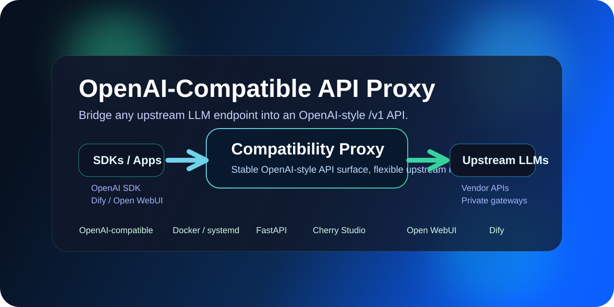
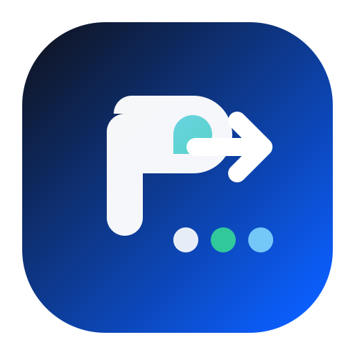

# OpenAI-Compatible API Proxy

<p align="center">
  
</p>

<p align="center">
  
</p>

<p align="center">
  <a href="README.zh-CN.md">中文文档</a> · <a href="docs/architecture.md">Architecture</a>
</p>


Turn any LLM API into an OpenAI-compatible endpoint in minutes.

A lightweight compatibility proxy that wraps your upstream model endpoint behind an OpenAI-style `/v1/*` API, so existing SDKs, clients, and workflows can connect with minimal changes.

## Why This Exists

A lot of AI apps already know how to talk to the OpenAI API. The real problem is not calling a model - it is preserving compatibility across SDKs, tools, deployments, and vendor changes.

This project helps you:

- keep an OpenAI-style API surface
- reduce downstream migration cost
- plug existing tools into a different upstream
- keep flexibility for private deployment, routing, and cost control

## Features

- Exposes `GET /v1/models`
- Proxies `GET/POST /v1/{path}` to your upstream
- Passes through request headers safely
- Optionally forces `stream=true` for `chat/completions`
- Supports environment-based configuration
- Includes Docker, Compose, systemd, and usage examples

## Best For

- Wrapping a private or third-party LLM endpoint behind an OpenAI-style API
- Reusing existing OpenAI SDK integrations without rewriting client code
- Connecting tools like Open WebUI, Dify, Cherry Studio, or internal apps
- Building an internal AI gateway with minimal moving parts

## Quick Start

### Local Python

```bash
cp .env.example .env
pip install -r requirements.txt
export $(grep -v '^#' .env | xargs)
uvicorn proxy:app --host 0.0.0.0 --port 9000
```

### Docker

```bash
cp .env.example .env
docker build -t openai-compatible-proxy .
docker run --rm -p 9000:9000 --env-file .env openai-compatible-proxy
```

### Docker Compose

```bash
cp .env.example .env
docker compose up -d --build
```

## Configuration

Main environment variables:

- `REAL_BASE`: upstream OpenAI-compatible base URL
- `PROXY_MODELS`: comma-separated model ids exposed by `/v1/models`
- `FORCE_CHAT_STREAM`: force `stream=true` for chat completions
- `PROXY_TIMEOUT`: upstream timeout in seconds
- `PROXY_TITLE`: title shown on `/`

See `.env.example` for defaults.

## API

### `GET /`

Returns basic metadata about the proxy.

### `GET /healthz`

Returns a simple health check payload.

### `GET /v1/models`

Returns a model list based on `PROXY_MODELS`.

### `GET/POST /v1/{path}`

Forwards requests to:

```text
{REAL_BASE}/{path}
```

## Usage Examples

### cURL

```bash
curl http://127.0.0.1:9000/v1/models
```

```bash
curl http://127.0.0.1:9000/v1/chat/completions \
  -H 'Content-Type: application/json' \
  -H 'Authorization: Bearer your-key' \
  -d '{
    "model": "gpt-4o-mini",
    "messages": [{"role": "user", "content": "hello"}]
  }'
```

### Compatible Tools

This pattern is useful when connecting tools that already expect OpenAI-compatible APIs, such as:

- OpenAI Python SDK
- OpenAI Node SDK
- Cherry Studio
- Open WebUI
- Dify
- Any app that accepts `base_url` / `api_base`

## Architecture

<p align="center">
  
</p>

See `docs/architecture.md` for the simplified request flow and positioning.

## Project Structure

```text
.
├── assets/
│   └── icon.svg
├── proxy.py
├── requirements.txt
├── .env.example
├── Dockerfile
├── docker-compose.yml
├── docs/
│   ├── compatibility.md
│   ├── deployment.md
│   ├── faq.md
│   └── troubleshooting.md
└── examples/
    ├── python-openai-sdk/
    ├── cherry-studio/
    ├── open-webui/
    └── dify/
```

## Docs

- `docs/compatibility.md`
- `docs/deployment.md`
- `docs/faq.md`
- `docs/troubleshooting.md`
- `README.zh-CN.md`

## Use Cases

- Wrap a non-OpenAI upstream behind a familiar API
- Switch model vendors without changing downstream clients
- Add a thin compatibility layer for internal AI tools
- Provide one stable endpoint to multiple teams or apps

## Who Should Use This

- Developers who already rely on OpenAI SDKs
- Teams migrating away from a single model vendor
- Builders who want a simple compatibility layer before adopting a full AI gateway
- Anyone who needs a stable API surface for tools, automations, or internal platforms

## Roadmap

See `ROADMAP.md`.

## Changelog

See `CHANGELOG.md`.

## License

MIT
